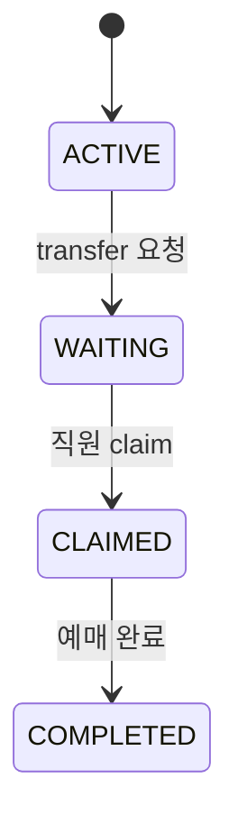

# ARCHITECTURE

## 1. 전체 구조

```mermaid
flowchart LR
    K[Kiosk React /kiosk]
    S[Staff React /staff]
    B[Spring Boot]
    DB[(Database)]

    K -->|REST| B
    S -->|REST| B
    B --> DB

    K -. subscribe .->|STOMP /topic/sessions/{id}| B
    S -. optional subscribe .-> B
    B -. publish event .-> K
```

Frontend 프로젝트는 하나를 사용하고 Route로 Kiosk와 Staff를 분리합니다.

```text
frontend
 ├─ /kiosk
 └─ /staff
```

Backend도 해커톤 규모에 맞게 단일 Spring Boot Application을 사용합니다.

---

## 2. 핵심 Domain

### OrderSession

하나의 사용자가 키오스크에서 진행 중인 예매 상태입니다.

예시:

```json
{
  "id": 123,
  "status": "WAITING",
  "currentStep": "SEAT_SELECTION",
  "departure": "동서울",
  "destination": "강릉",
  "travelDate": "2026-08-11",
  "departureTime": "11:30",
  "busGrade": "PREMIUM",
  "seatNo": null,
  "transferCode": "381492"
}
```

---

## 3. 상태 모델



### ACTIVE

사용자가 키오스크에서 예매 중.

### WAITING

사용자가 도움 요청을 눌렀고 이어받기를 기다리는 상태.

### CLAIMED

직원이 해당 Session을 불러와 이어받은 상태.

### COMPLETED

직원이 최종 완료 처리한 상태.

MVP에서는 불필요한 상태를 추가하지 않습니다.

---

## 4. Step Enum

권장:

```text
DESTINATION
DATE
SCHEDULE
SEAT_SELECTION
CONFIRMATION
PAYMENT
COMPLETED
```

Frontend 문자열과 Backend Enum의 철자를 반드시 동일하게 맞춥니다.

---

## 5. Realtime 역할

WebSocket은 데이터를 저장하는 수단이 아닙니다.

### REST

- Session 생성
- Session 수정
- Transfer Code 생성
- Session 조회
- Claim
- Complete

### WebSocket

- Session 상태가 바뀌었다는 이벤트 전달

예:

```json
{
  "type": "SESSION_COMPLETED",
  "sessionId": 123
}
```

Kiosk는 이벤트를 받으면 필요에 따라 REST로 최신 Session을 다시 조회하거나 완료 화면으로 전환합니다.

---

## 6. 왜 이 구조인가

해커톤에서 중요한 것은 분산 시스템이 아니라 **완전한 사용자 흐름**입니다.

따라서 다음을 사용하지 않습니다.

- Microservice
- Kafka
- Redis
- RabbitMQ
- 별도 Node Realtime Server

Spring Boot 하나에서 REST와 WebSocket을 같이 처리합니다.

---

## 7. Dependency Rule

```text
pages
  ↓
components
  ↓
api
  ↓
backend REST/WebSocket
```

Frontend에서 페이지 컴포넌트가 URL 문자열을 직접 작성하지 않도록 `api/`에 모읍니다.

Backend:

```text
Controller
   ↓
Service
   ↓
Repository
```

해커톤 규모에서 과도한 Layer 분리는 지양합니다.
